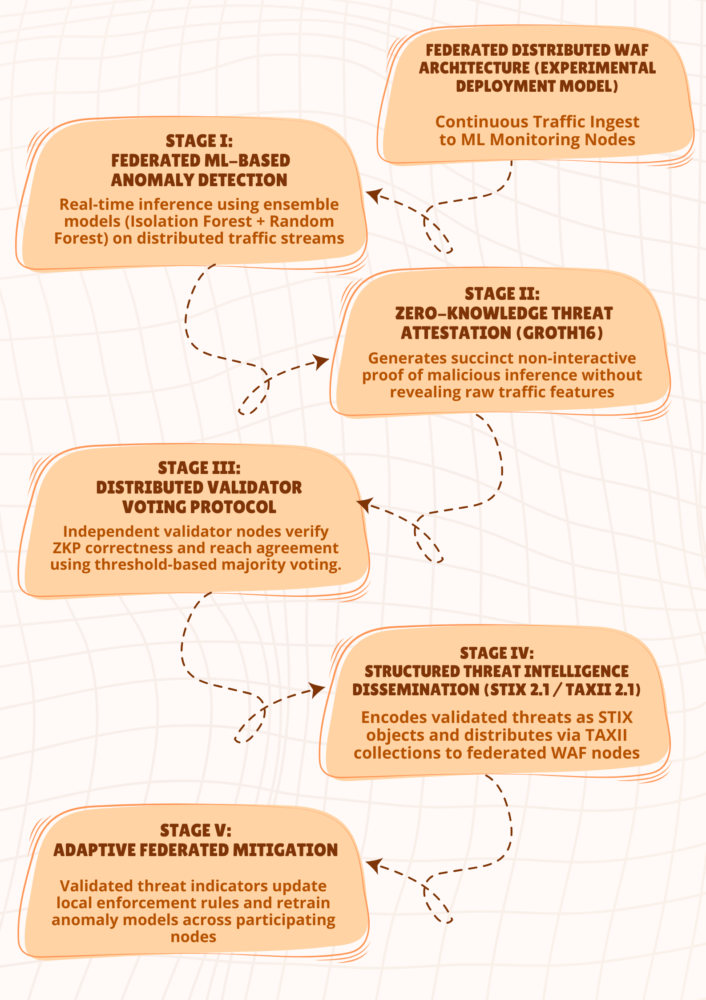

# Distributed Web Application Firewall (DWAF)

## Overview
- The Distributed Web Application Firewall (DWAF) is a federated security architecture that combines machine learning–based anomaly detection, zero-knowledge cryptographic attestation (Groth16), distributed validator voting, and STIX/TAXII–based threat intelligence sharing.

- DWAF enables collaborative threat detection across multiple nodes while preserving sensitive traffic data through privacy-preserving proof generation and structured intelligence dissemination.

## Architecture
DWAF operates as a multi-stage security pipeline:

1) **Federated ML-Based Anomaly Detection**
- Real-time inference using ensemble models (Isolation Forest + Random Forest) on distributed traffic streams.

2) **Zero-Knowledge Threat Attestation (Groth16)**
- Generates succinct non-interactive proofs of malicious inference without exposing raw traffic features.

3) **Distributed Validator Voting Protocol**
- Independent validator nodes verify ZKP correctness and reach agreement using threshold-based majority voting.

4) **Structured Threat Intelligence Dissemination (STIX 2.1 / TAXII 2.1)**
- Validated threats are encoded as STIX objects and distributed via TAXII collections to participating WAF nodes.

5) **Adaptive Federated Mitigation**
- Approved threat indicators update enforcement rules and inform local model adaptation across nodes.

## Core Components
(I) **🔍 Federated ML-Based Detection**
- Ensemble anomaly detection (Isolation Forest + Random Forest)

(II) **🔐 Zero-Knowledge Threat Attestation (Groth16)**
- Proves malicious inference without exposing raw traffic data

(III) **🗳 Distributed Validator Voting**
- Multi-node threshold-based verification of ZKP proofs

(IV) **🌐 Structured Threat Sharing (STIX 2.1 / TAXII 2.1)**
- Standardised intelligence dissemination across nodes

(V) **🔄 Adaptive Federated Mitigation**
- Validated threats update enforcement rules and inform model adaptation

## Tech Stack
• Rust – ZKP layer
• Python (Flask) – ML detector & TAXII server
• Docker / Docker Compose – Service orchestration
• STIX 2.1 / TAXII 2.1 – Threat intelligence standardization
• Groth16 (BN254) – Zero-knowledge proof system

## Quick Start
1️⃣ Build Services
- make build

2️⃣ Start Core Services
- make up

3️⃣ Run Full Integration 
- make up-all

4️⃣ Check Health
- make health

5️⃣ Run Demo
- make demo

## Authors and Contributions
- **Tanvi Badghare** led the project, designed the end-to-end system architecture, and developed the Zero-Knowledge Proof (Groth16)–based privacy validation layer and distributed verification workflow.
- **Aditi Pandey** and **Anjali** implemented, tuned, and evaluated the machine learning–based anomaly detection models (Isolation Forest and Random Forest).
- **Jivesh Rai** designed and implemented the STIX 2.1 / TAXII 2.1 threat intelligence distribution module.
- **Anshul** contributed to technical documentation, system structuring, and repository organization.

## Research Context
DWAF is an experimental exploration of combining:
- Privacy-preserving cryptography
- Distributed validation
- Standardised cyber threat intelligence
- Federated anomaly detection
into a unified distributed WAF architecture.

## ⚠️ ⚠️ Security & Key Management Notice
- ZKP parameters and cryptographic keys included are for demonstration/testing only
- Production-grade trusted setup and secure key storage are not yet implemented
- Sensitive material will be excluded from version control in future hardened versions

